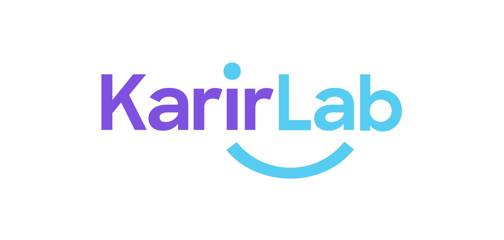
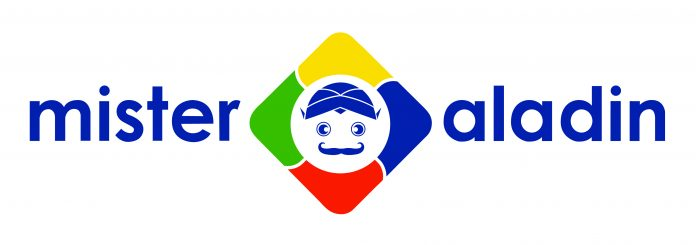

# Projects

## KarirLab

A platform for career and professional development, connecting users and institutions with employers.

- **Technologies**: Go, PostgreSQL, Redis, AWS
- **Features**:
  - Resume Builder
  - Resume Evaluation
  - Event
  - Company, Company Scrapper
  - Job, Job Scrapper
  - Job Applicant (auto matching score, resume score)
  - Company and employer platform
- **Live Demo**: [KarirLab](https://karirlab.co)
- **Repository**: Github Private

## Mister Aladin

Online travel platform including hotel booking, train, flight, attraction, activities and tour package.

- **Technologies**: Go, PHP (Laravel, Lumen, YII), MySQL, MongoDB, Redis, RabbitMQ, AWS
- **Features**:
  - Hotel, Hotel Extranet, Hotel Scrapper
  - Auth & User
  - General (Location, Backoffice, B2B, CMS)
  - Promotion, Payment
- **Live Demo**: [Mister Aladin](https://misteraladin.com)
- **Repository**: Bitbucket Private

## Foodpalate

A provider of online food / meal-kit delivery service.

- **Technologies**: PHP (Laravel), MySQL, Vue.js, Alibaba Cloud
- **Features**:
  - Menu
  - Cookbook
  - Promotion, Payment
- **Live Demo**: [Foodpalate](https://foodpalate.com.au.com)
- **Repository**: GitLab Private

## Chick N Roll

- **Technologies**: PHP, Laravel, MySQL
- **Features**:
  - Menu
  - Games
  - Membership
  - Point
  - Merchant

## Forever Jewelry

- **Technologies**: PHP, Laravel, MySQL

## Kalcare

- **Technologies**: PHP, CodeIgniter, MySQL

## ICCC

Indonesia Cancer Care Community (ICCC) is a community born from the compassion of cancer Warriors, Survivors, and Caregivers.

- **Technologies**: PHP, CodeIgniter, MySQL
- **Features**:
  - All about cancer
  - Nutrition
  - Hospital & doctor list
  - Forum & community
  - Event & news
  - Membership
- **Live Demo**: [ICCC](https://iccc.id)

## Sahabat Ginjal

An umbrella brand for kidney-related products.

- **Technologies**: PHP, CodeIgniter, MySQL
- **Live Demo**: [Sahabat Ginjal](https://sahabatginjal.com)

## Aktuarium

- **Technologies**: PHP, CodeIgniter, MySQL

## AHU

Official Website of the Directorate General of General Legal Administration, Ministry of Law and Human Rights of the Republic of Indonesia.

- **Technologies**: PHP, Yii, MySQL
- **Live Demo**: [AHU](https://ahu.go.id)

## SIDBANKUM

- **Technologies**: PHP, Yii, MySQL
- **Live Demo**: [SIDBANKUM](https://sidbankum.bphn.go.id)

## Nucleus Logic

Enterprise Resource Planning (ERP) cloud based.

- **Technologies**: PHP, MySQL
- **Features**:
  - Sales & Purchase
  - Stock & Inventory
  - Supplier Smart Order

- **Live Demo**: [Nuclues Logic](https://nucleuslogic.com.au)

---

Feel free to reach out if you have any questions or want to collaborate on future projects!
